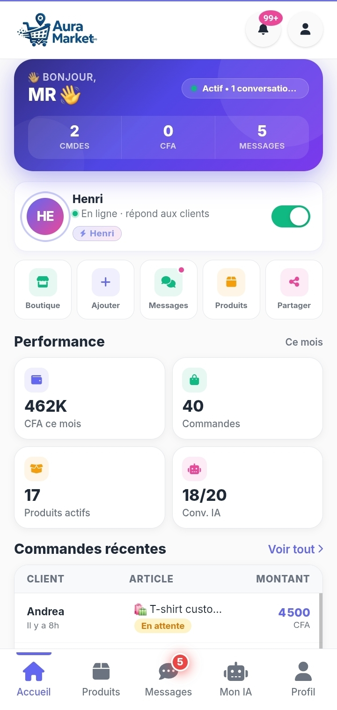
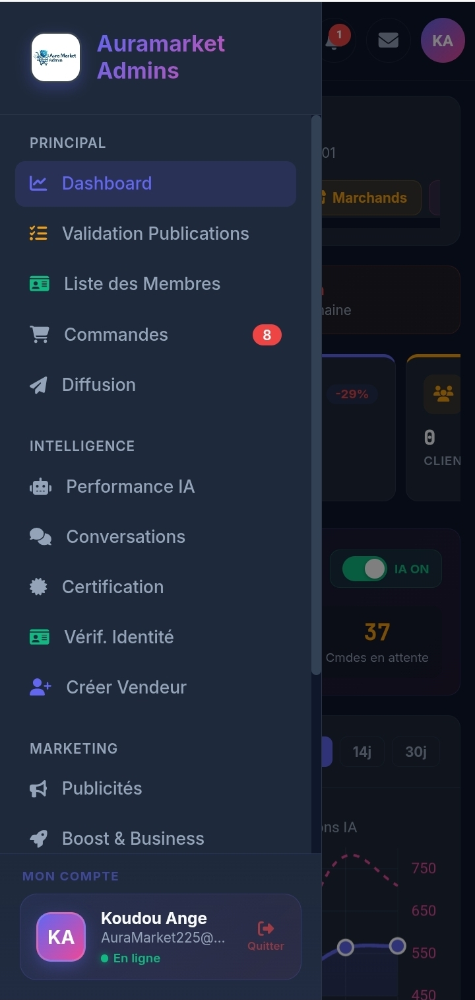
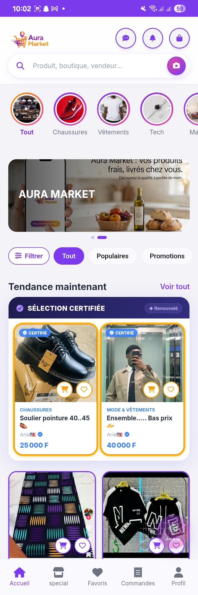

🛍️ Auramarket Pro
Marketplace e-commerce complète dédiée aux vendeurs de Côte d'Ivoire — construite seul, en 7 semaines, sur téléphone.
Développeur : myckis — 21 ans, autodidacte, Abidjan 🇨🇮
🌍 Aperçu
Auramarket Pro est une plateforme de commerce en ligne pensée pour le marché ivoirien. Elle digitalise les vendeurs WhatsApp d'Abidjan en leur offrant une boutique professionnelle, un assistant IA intégré, et un système de paiement mobile money natif.
🔗 Applications en production
Application
Lien
Description
🛒 Interface Client
auramarketci.com
Parcourir, commander, suivre
🏪 Dashboard Vendeur
auramarket1pro.pages.dev
Gérer sa boutique et ses ventes
⚙️ Panel Admin
auramarketpro22administrateurs.pages.dev
Supervision complète de la plateforme
📊 Métriques réelles (Mars 2026)
41 commandes traitées
18 marchands inscrits dont 11 certifiés
462 000 FCFA de volume vendeur ce mois
22 conversations IA actives simultanément
Indexé sur Google — fiche établissement active
✨ Fonctionnalités principales
Côté Client
Recherche produits, filtres par catégorie
Panier, favoris, historique de navigation
Suivi des commandes en temps réel (Reçue → Confirmée → Livrée)
Assistant IA Aura IA intégré
Système de parrainage + points fidélité
Installation PWA (iOS & Android)
Côté Vendeur
Dashboard avec stats temps réel (ventes, commandes, produits actifs)
Assistant IA configurable — nom, ton (Professionnel / Amical / Nouchi 🇨🇮), horaires, langues (Dioula, Bambara)
Quota de conversations IA par jour
Système de certification avec badge vérifié
Sponsoring de produits dès 500 FCFA
Export CSV des statistiques
Vérification d'identité (selfie + CNI)
Côté Admin
Tableau de bord live avec graphe d'évolution des ventes
Validation des publications
Gestion membres (clients + marchands)
Suivi commandes plateforme avec export PDF
Gestion certifications et expirations
Logs système + sécurité
Diffusion de notifications groupées
🛠️ Stack technique
Frontend     : HTML / CSS / JavaScript (Vanilla)
Base de données : Firebase Firestore
Auth         : Firebase Authentication (email + Google Sign-In)
Stockage     : Firebase Storage
Notifications : Firebase Cloud Messaging (FCM)
Backend/API  : Cloudflare Workers (proxy sécurisé)
IA           : Groq API / Llama (via Cloudflare Worker)
Paiements    : Jeko Africa (Wave, MTN MoMo, Orange Money)
Email        : EmailJS
PWA          : Service Worker + manifest.json
Images       : ImgBB via proxy sécurisé
🔐 Architecture sécurité
Firestore Security Rules — règles par rôle : isClient(), isVendeur(), isAdminDoc()
Clés API protégées — aucune clé exposée côté client, tout passe par des Workers Cloudflare
Authentification Firebase — tokens vérifiés sur chaque requête sensible
Accès IA contrôlé — quota journalier par rôle, toggle admin global
Vérification d'identité — selfie + pièce d'identité avec validation manuelle admin
🏗️ Architecture générale
Client (PWA)
    │
    ├── Firebase Auth ──────── Firestore (règles par rôle)
    │                               │
    ├── Cloudflare Workers ─────────┤
    │   ├── /groq-api               │
    │   ├── /imgbb-upload           ├── vendeurs/
    │   ├── /fcm-worker             ├── clients/
    │   └── /firestore-cache        ├── admins/
    │                               ├── articles/
    └── Firebase Storage            └── commandes/
🌍 Adaptation marché local
Paiement mobile money natif (Wave CI, MTN MoMo, Orange Money)
Assistant IA avec support Nouchi, Dioula, Bambara
Conçu pour les vendeurs WhatsApp d'Abidjan
Interface optimisée mobile (marché à 95% mobile)
## 📱 Screenshots

### Interface Client

### Dashboard Vendeur

### Panel Admin

👨‍💻 À propos
Projet construit seul, sur téléphone, en 7 semaines, sans formation académique spécialisée.
Motivé par une expérience personnelle en tant que vendeur en ligne à Abidjan — j'ai construit l'outil que j'aurais voulu avoir.
© 2026 myckis — Abidjan, Côte d'Ivoire
